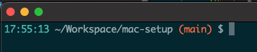
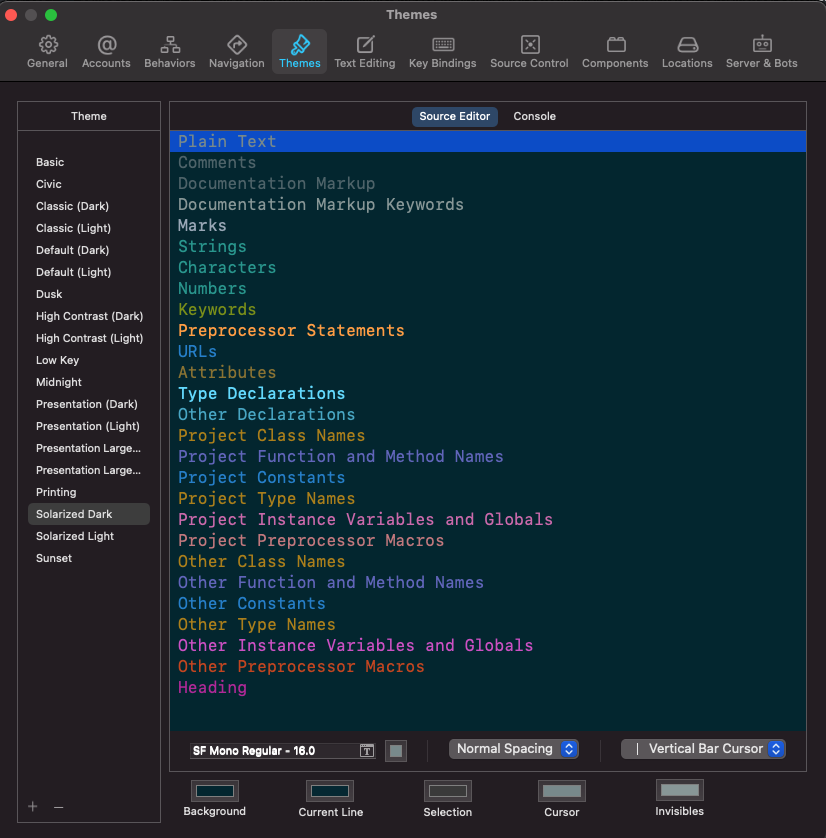

# Mac Setup

## Solarized

I stumbled across [Solarized](https://github.com/altercation/solarized) a few years back. I was struggling with some aspects of standard Xcode themes. I find it hard to read the red text in the standard "Dusk" theme for example.

With Solarized, I like that the colours are not too bright and the contrast between colours works well. It uses greys instead of bright whites or harsh blacks.

I mainly use Dark mode. It feels easier on my eyes, so I haven't made much use of the light versions of Solarized.

## Terminal

I use the native Mac Terminal with a Solarized [profile](terminal/SolarizedDark.terminal)

The `.zshrc` file is [here](zsh/.zshrc)

### Weather in the Terminal

I incorporated the weather into the terminal prompt at one point. Some caching was configured to avoid hiting the weather API too often. It was fun to do, but not super-useful to have set up permanently, and occasionally the terminal would look wonky when the API was unavailable.

Instead now I have an alias for checking the weather, which calls `curl wttr.in`

The wttr.in project is well worth checking out. You can find it [here](https://github.com/chubin/wttr.in).

## Xcode

I use a tweaked version of the Solarized Dark color scheme. The scheme is [here](xcode/SolarizedDark.xccolortheme). The original is [here](https://github.com/stackia/solarized-xcode).

To install the profile, copy the xccolortheme file into `~/Library/Developer/Xcode/UserData/FontAndColorThemes`, restart Xcode and select it in Preferences from the Themes tab

## Ruby

- [ruby-install](https://github.com/postmodern/ruby-install) for installing Ruby versions e.g. `ruby-install 2.7.2`
- [chruby](https://github.com/postmodern/chruby) for switching between them e.g. `chruby 2.7.2`

I have used [RVM](https://rvm.io) on company machines which seems able to navigate proxies more easily.

## SSH

There is a script [here](ssh/loadkeys.sh) which is helpful for loading ssh keys for a set number of hours and for switching ssh credentials if needed.

If working on a shared workstation it can be good practice to use a script like this to load ssh keys from a USB key. The USB key should be encrypted in case lost.
